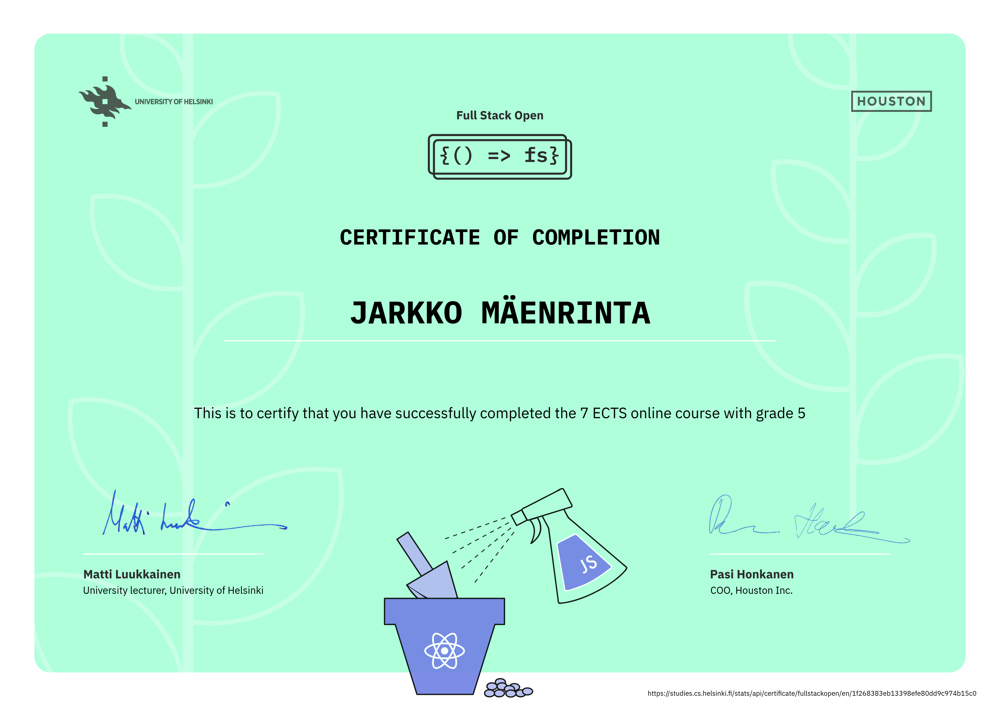

# Full Stack Open

My solutions for the [Full Stack Open](https://fullstackopen.com) course by the [University of Helsinki](https://www.helsinki.fi). This repository contains solutions for parts 0 through 9. Solutions for part 10 are available in a separate repository [here](https://github.com/jarkmaen/full-stack-open-part-10).

## Parts

- [x] Part 0 - [Fundamentals of Web apps](https://fullstackopen.com/en/part0)
- [x] Part 1 - [Introduction to React](https://fullstackopen.com/en/part1)
- [x] Part 2 - [Communicating with server](https://fullstackopen.com/en/part2)
- [x] Part 3 - [Programming a server with NodeJS and Express](https://fullstackopen.com/en/part3)
- [x] Part 4 - [Testing Express servers, user administration](https://fullstackopen.com/en/part4)
- [x] Part 5 - [Testing React apps](https://fullstackopen.com/en/part5)
- [x] Part 6 - [Advanced state management](https://fullstackopen.com/en/part6)
- [x] Part 7 - [React router, custom hooks, styling app with CSS and webpack](https://fullstackopen.com/en/part7)
- [x] Part 8 - [GraphQL](https://fullstackopen.com/en/part8)
- [x] Part 9 - [TypeScript](https://fullstackopen.com/en/part9)
- [x] Part 10 - [React Native](https://fullstackopen.com/en/part10)

## Certificates

### Core

### GraphQL

### TypeScript

### React Native

